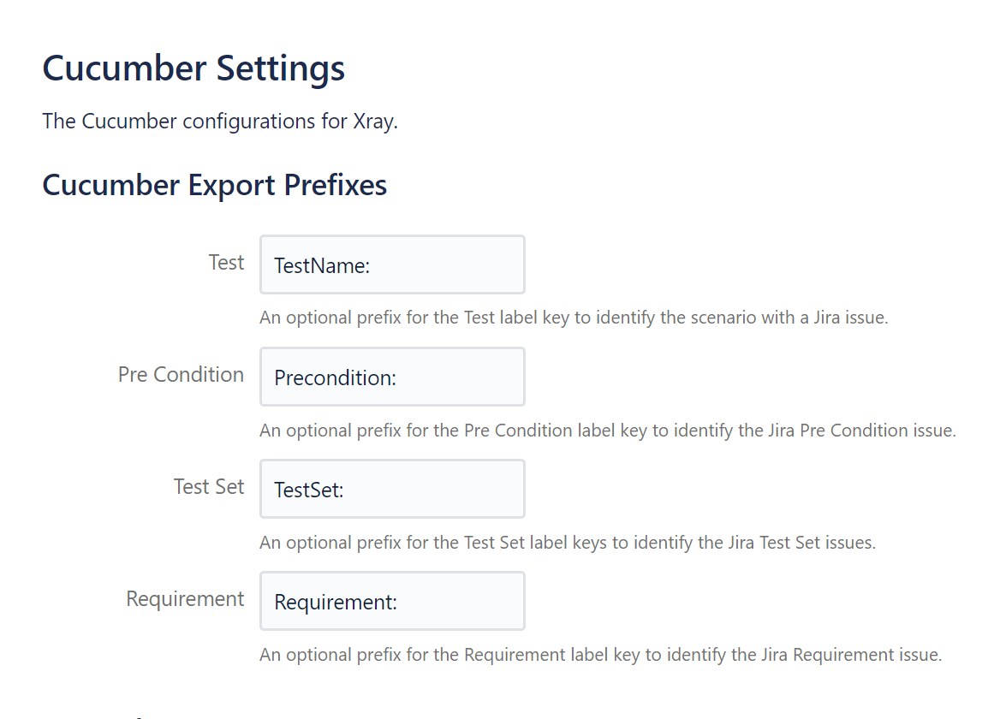

# Cucumber

When Cucumber is enabled, you can use the following options to configure the way the plugin works with your feature files.

## Mandatory settings

### `featureFileExtension`

The file extension of feature files you want to run in Cypress.
The plugin will use this to parse all matching files to extract any tags contained within them.
Such tags are needed to identify to which test issue a feature file belongs (see [targeting existing test issues with Cucumber](../guides/targetingExistingIssues.md#reuse-cucumber-issues)).

***Environment variable***
: `CUCUMBER_FEATURE_FILE_EXTENSION`

***Type***
: `string`

??? example
    === "Cypress configuration"
        ```js
        await configureXrayPlugin(on, config, {
            cucumber: {
                featureFileExtension: ".feature"
            },
        });
        ```
    === "Environment variable"
        ```sh
        npx cypress run --env CUCUMBER_FEATURE_FILE_EXTENSION=".feature"
        ```

## Optional settings

### `downloadFeatures`

!!! development
    This feature will be added in future versions of the plugin.

Set it to true to automatically download feature files from Xray for Cypress to execute.
!!! note
    Enable this option if the source of truth for test cases are step definitions in Xray and Cypress is only used for running tests.

***Environment variable***
: `CUCUMBER_DOWNLOAD_FEATURES`

***Type***
: [`boolean`](types.md#boolean)

***Default***
: `#!js false`

??? example
    === "Cypress configuration"
        ```js
        await configureXrayPlugin(on, config, {
            cucumber: {
                downloadFeatures: true
            },
        });
        ```
    === "Environment variable"
        ```sh
        npx cypress run --env CUCUMBER_DOWNLOAD_FEATURES=true
        ```

<hr/>

### `prefixes`

Whenever Cucumber test results or entire feature files are imported, Xray tries to link existing test and precondition Jira issues with the executed/present Cucumber scenarios and backgrounds.
The default matching is quite involved (see documentation for [Xray server](https://docs.getxray.app/display/XRAY/Importing+Cucumber+Tests+-+REST) or [Xray cloud](https://docs.getxray.app/display/XRAYCLOUD/Importing+Cucumber+Tests+-+REST)), but luckily Xray also supports and uses [feature file tags](https://cucumber.io/docs/cucumber/api/?lang=java#tags).
The tags are of the form `#!gherkin @[prefix]CYP-123`, containing an optional prefix and the issue key.
The concrete prefix and whether a prefix is at all necessary depends on your configured prefix scheme in Xray.

The scheme itself can be viewed and configured in Xray:

- [Xray server](https://docs.getxray.app/display/XRAY/Miscellaneous#Miscellaneous-CucumberExportPrefixes)
- [Xray cloud](https://docs.getxray.app/display/XRAYCLOUD/Global+Settings%3A+Cucumber)

!!! question "What if I don't have access to Xray's configuration?"
    The easiest way to identify the prefixes you need to use is to export an existing test issue to a Cucumber feature file.

    - [Xray server](https://docs.getxray.app/pages/viewpage.action?pageId=62268093#Gherkin(BDDTests)-ExporttoCucumber)
    - [Xray cloud](https://docs.getxray.app/display/XRAYCLOUD/Gherkin#Gherkin-ExporttoCucumber)

    If the test issue has preconditions, test sets and requirements (see [Xray server](https://docs.getxray.app/display/XRAY/Requirements+and+Defects) or [Xray cloud](https://docs.getxray.app/display/XRAYCLOUD/Requirements+and+Defects)) configured, the exported feature file will automatically contain the full tagging scheme.
    This scheme can subsequently be used to configure the plugin accordingly.

!!! example

    Let's assume that the Xray tagging scheme is defined as follows:

    { style="border: 1px solid var(--md-default-fg-color);" }

    Scenarios then need to be annotated with `#!gherkin @TestName:<key>` to link the scenarios to an existing test issue in Jira.
    Correspondingly, backgrounds will need be tagged with `#!gherkin @Precondition:<key>` inside the first step's comment to link to existing precondition issues.

    ```gherkin hl_lines="4 9"
    Feature: A cool story

        Background:
            #@Precondition:CYP-222
            Given A
            When B
            Then C

        @TestName:CYP-333
        Scenario: Scenario 1
            Given X
            When Y
            Then Z
    ```

<hr/>

#### `precondition`

The prefix for Cucumber background tags.

If left undefined, the plugin will assume that your Xray instance is able to properly parse issue tags _without_ any prefixes, e.g. background tags of the form `#!gherkin @CYP-123` instead of something like `#!gherkin @Precondition:CYP-123`.

***Environment variable***
: `CUCUMBER_PREFIXES_PRECONDITION`

***Type***
: `string`

***Default***
: `#!js undefined`

??? example
    === "Cypress configuration"
        ```js
        await configureXrayPlugin(on, config, {
            cucumber: {
                prefixes: {
                    precondition: "Precondition:"
                }
            },
        });
        ```
    === "Environment variable"
        ```sh
        npx cypress run --env CUCUMBER_PREFIXES_PRECONDITION="Precondition:"
        ```

<hr/>

#### `test`

The prefix for Cucumber scenario tags.

If left undefined, the plugin will assume that your Xray instance is able to properly parse issue tags _without_ any prefixes, e.g. scenario tags of the form `#!gherkin @CYP-123` instead of something like `#!gherkin @TestName:CYP-123`.

***Environment variable***
: `CUCUMBER_PREFIXES_TEST`

***Type***
: `string`

***Default***
: `#!js undefined`

??? example
    === "Cypress configuration"
        ```js
        await configureXrayPlugin(on, config, {
            cucumber: {
                prefixes: {
                    test: "TestName:"
                }
            },
        });
        ```
    === "Environment variable"
        ```sh
        npx cypress run --env CUCUMBER_PREFIXES_TEST="TestName:"
        ```

<hr/>

### `uploadFeatures`

Set it to true to automatically create or update existing Xray issues (steps, labels, ...), based on the feature file executed by Cypress.
!!! note
    Enable this option if the source of truth for test cases are local feature files in Cypress and Xray is only used for tracking execution status/history.

***Environment variable***
: `CUCUMBER_UPLOAD_FEATURES`

***Type***
: [`boolean`](types.md#boolean)

***Default***
: `#!js false`

??? example
    === "Cypress configuration"
        ```js
        await configureXrayPlugin(on, config, {
            cucumber: {
                uploadFeatures: true
            },
        });
        ```
    === "Environment variable"
        ```sh
        npx cypress run --env CUCUMBER_UPLOAD_FEATURES=true
        ```
