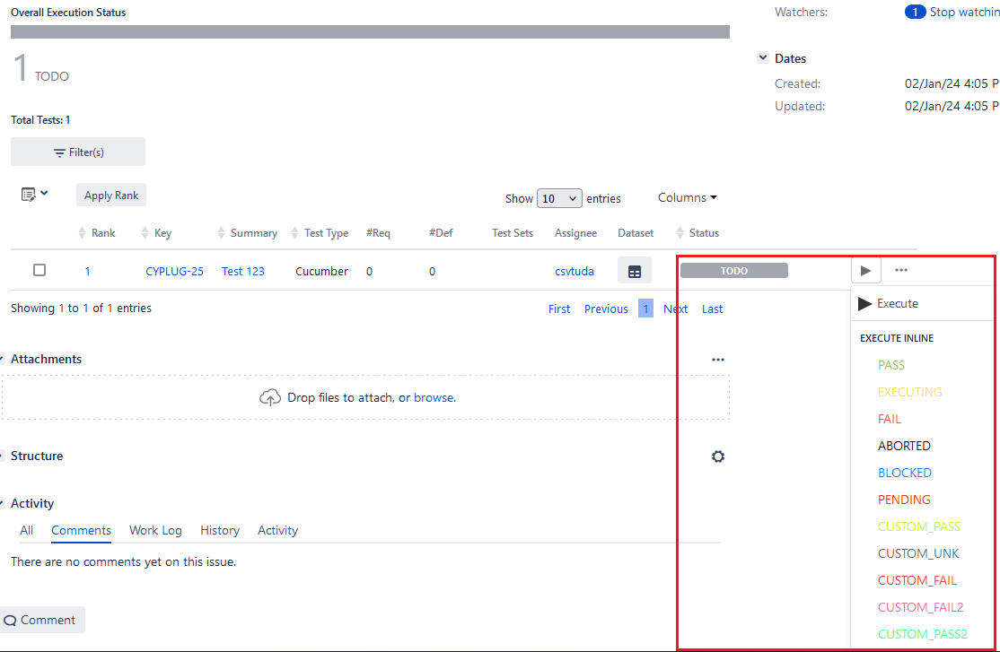
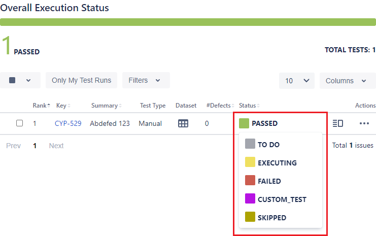
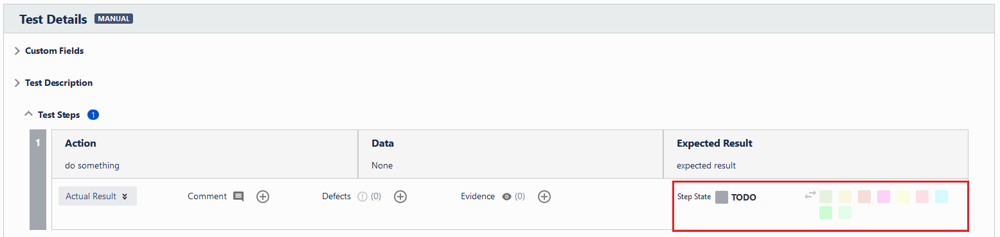
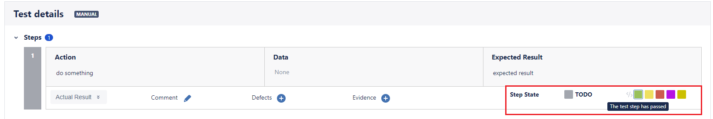

# Xray

You can provide a bunch of Xray settings which might become necessary depending on your project configuration.

## Optional settings

### `status`

These status options represent the mapping of Cypress statuses to corresponding Xray _test_ statuses.
If you have custom _test_ statuses set up in Xray, you should specify their names here.

=== "Xray server"
    
=== "Xray cloud"
    

!!! info
    For more information on test statuses, please refer to the official documentation:

    - Xray server: [https://docs.getxray.app/display/XRAY/Manage+Test+Statuses](https://docs.getxray.app/display/XRAY/Manage+Test+Statuses)
    - Xray cloud: [https://docs.getxray.app/display/XRAYCLOUD/Global+Settings%3A+Test+Statuses](https://docs.getxray.app/display/XRAYCLOUD/Global+Settings%3A+Test+Statuses)

<hr/>

#### `failed`

The Xray status name of a test marked as failed by Cypress.

***Environment variable***
: `XRAY_STATUS_FAILED`

***Type***
: `string`

***Default***
: `#!js "FAIL"` (when providing Xray server credentials)
: `#!js "FAILED"` (when providing Xray cloud credentials)

??? example
    === "Cypress configuration"
        ```js
        await configureXrayPlugin(on, config, {
            xray: {
                status: {
                    failed: "FAILURE"
                }
            },
        });
        ```
    === "Environment variable"
        ```sh
        npx cypress run --env XRAY_STATUS_FAILED=FAILURE
        ```

<hr/>

#### `passed`

The Xray status name of a test marked as passed by Cypress.

***Environment variable***
: `XRAY_STATUS_PASSED`

***Type***
: `string`

***Default***
: `#!js "PASS"` (when providing Xray server credentials)
: `#!js "PASSED"` (when providing Xray cloud credentials)

??? example
    === "Cypress configuration"
        ```js
        await configureXrayPlugin(on, config, {
            xray: {
                status: {
                    passed: "SUCCESS"
                }
            },
        });
        ```
    === "Environment variable"
        ```sh
        npx cypress run --env XRAY_STATUS_PASSED=SUCCESS
        ```

<hr/>

#### `pending`

The Xray status name of a test marked as pending by Cypress.

***Environment variable***
: `XRAY_STATUS_PENDING`

***Type***
: `string`

***Default***
: `#!js "TODO"` (when providing Xray server credentials)
: `#!js "TO DO"` (when providing Xray cloud credentials)

??? example
    === "Cypress configuration"
        ```js
        await configureXrayPlugin(on, config, {
            xray: {
                status: {
                    pending: "AWAITING EXECUTION"
                }
            },
        });
        ```
    === "Environment variable"
        ```sh
        npx cypress run --env XRAY_STATUS_PENDING="AWAITING EXECUTION"
        ```

<hr/>

#### `skipped`

The Xray status name of a test marked as skipped by Cypress.

***Environment variable***
: `XRAY_STATUS_SKIPPED`

***Type***
: `string`

***Default***
: `#!js "FAIL"` (when providing Xray server credentials)
: `#!js "FAILED"` (when providing Xray cloud credentials)

    !!! note
        Defaults to `#!js "FAILED"` because Cypress only skips test cases if errors occur, as described [here](https://docs.cypress.io/guides/core-concepts/writing-and-organizing-tests#Skipped).

??? example
    === "Cypress configuration"
        ```js
        await configureXrayPlugin(on, config, {
            xray: {
                status: {
                    skipped: "IGNORED"
                }
            },
        });
        ```
    === "Environment variable"
        ```sh
        npx cypress run --env XRAY_STATUS_SKIPPED="IGNORED"
        ```

#### `step`

These status options represent the mapping of _step_ statuses to corresponding Xray _step_ statuses.
If you have custom statuses set up in Xray, you should specify their names here.

=== "Xray server"
    
=== "Xray cloud"
    

!!! info
    For more information on test step statuses, please refer to the official documentation:

    - Xray server: [https://docs.getxray.app/display/XRAY/Manage+Test+Step+Statuses](https://docs.getxray.app/display/XRAY/Manage+Test+Step+Statuses)
    - Xray cloud: [https://docs.getxray.app/display/XRAYCLOUD/Global+Settings%3A+Test+Step+Statuses](https://docs.getxray.app/display/XRAYCLOUD/Global+Settings%3A+Test+Step+Statuses)

!!! note
    These are currently only accessed in Cucumber report conversion.
    If you're not using Cucumber in your project, you can safely ignore them.

<hr/>

##### `failed`

The Xray status name of a step marked as failed.

***Environment variable***
: `XRAY_STATUS_STEP_FAILED`

***Type***
: `string`

***Default***
: `#!js undefined`

??? example
    === "Cypress configuration"
        ```js
        await configureXrayPlugin(on, config, {
            xray: {
                status: {
                    step: {
                        failed: "FAILURE"
                    }
                }
            },
        });
        ```
    === "Environment variable"
        ```sh
        npx cypress run --env XRAY_STATUS_STEP_FAILED=FAILURE
        ```

<hr/>

##### `passed`

The Xray status name of a step marked as passed.

***Environment variable***
: `XRAY_STATUS_STEP_PASSED`

***Type***
: `string`

***Default***
: `#!js undefined`

??? example
    === "Cypress configuration"
        ```js
        await configureXrayPlugin(on, config, {
            xray: {
                status: {
                    step {
                        passed: "SUCCESS"
                    }
                }
            },
        });
        ```
    === "Environment variable"
        ```sh
        npx cypress run --env XRAY_STATUS_STEP_PASSED=SUCCESS
        ```

<hr/>

##### `pending`

The Xray status name of a step marked as pending.

***Environment variable***
: `XRAY_STATUS_STEP_PENDING`

***Type***
: `string`

***Default***
: `#!js undefined`

??? example
    === "Cypress configuration"
        ```js
        await configureXrayPlugin(on, config, {
            xray: {
                status: {
                    step: {
                        pending: "AWAITING EXECUTION"
                    }
                }
            },
        });
        ```
    === "Environment variable"
        ```sh
        npx cypress run --env XRAY_STATUS_STEP_PENDING="AWAITING EXECUTION"
        ```

<hr/>

##### `skipped`

The Xray status name of a step marked as skipped.

***Environment variable***
: `XRAY_STATUS_STEP_SKIPPED`

***Type***
: `string`

***Default***
: `#!js undefined`

??? example
    === "Cypress configuration"
        ```js
        await configureXrayPlugin(on, config, {
            xray: {
                status: {
                    step: {
                        skipped: "IGNORED"
                    }
                }
            },
        });
        ```
    === "Environment variable"
        ```sh
        npx cypress run --env XRAY_STATUS_STEP_SKIPPED=IGNORED
        ```

<hr/>

### `testEnvironments`

The test environments for test execution issues. These will be used as follows:

- if the plugin creates new test execution issues, they will be associated with the issue
- if the plugin reuses existing test execution issues, they will either:
    - replace existing test environments
    - be added if the issue does not yet have any test environments associated

!!! note
    Xray's API only allows _replacing_ test environments in the plugin's scope.
    It is not possible to completely _remove_ all existing test environments during result upload.
    Completely removing all existing environments needs to be done manually.

    This means that you will always need to specify one or more test environments to replace all existing ones, or leave them as is by omitting the option entirely.

For more information about working with test environments, make sure to check out the documentation for [Xray server](https://docs.getxray.app/display/XRAY/Working+with+Test+Environments) or [Xray cloud](https://docs.getxray.app/display/XRAYCLOUD/Working+with+Test+Environments).

***Environment variable***
: `XRAY_TEST_ENVIRONMENTS`

***Type***
: [`string[]`](types.md)

***Default***
: `#!js undefined`

??? example
    === "Cypress configuration"
        ```js
        await configureXrayPlugin(on, config, {
            xray: {
                testEnvironments: ["DEV", "v3.1"]
            },
        });
        ```
    === "Environment variable"
        ```sh
        npx cypress run --env XRAY_TEST_ENVIRONMENTS=[DEV,v3.1]
        ```

<hr/>

### `uploadRequests`

Enables or disables the upload of manually executed requests using `cy.request`.
If `true`, requests and responses will be attached to the corresponding test as evidence.
If `false` or left `undefined`, neither requests nor responses are attached.

!!! note
    For this option to work properly, you need to [overwrite the `cy.request` command](../guides/uploadRequestData.md).


***Environment variable***
: `XRAY_UPLOAD_REQUESTS`

***Type***
: [`boolean`](types.md#boolean)

***Default***
: `#!js false`

??? example
    === "Cypress configuration"
        ```js
        await configureXrayPlugin(on, config, {
            xray: {
                uploadRequests: true
            },
        });
        ```
    === "Environment variable"
        ```sh
        npx cypress run --env XRAY_UPLOAD_REQUESTS=true
        ```

<hr/>

### `uploadResults`

Turns execution results upload on or off.
Useful when switching upload on or off from the command line (via environment variables).

***Environment variable***
: `XRAY_UPLOAD_RESULTS`

***Type***
: [`boolean`](types.md#boolean)

***Default***
: `#!js true`

??? example
    === "Cypress configuration"
        ```js
        await configureXrayPlugin(on, config, {
            xray: {
                uploadResults: false
            },
        });
        ```
    === "Environment variable"
        ```sh
        npx cypress run --env XRAY_UPLOAD_RESULTS=false
        ```

<hr/>

### `uploadScreenshots`

Turns on or off the upload of screenshots Cypress takes during test execution.
!!! note
    This option only takes effect once [`uploadResults`](#uploadresults) is turned on.
    It is not possible to upload screenshots without uploading results.

***Environment variable***
: `XRAY_UPLOAD_SCREENSHOTS`

***Type***
: [`boolean`](types.md#boolean)

***Default***
: `#!js true`

??? example
    === "Cypress configuration"
        ```js
        await configureXrayPlugin(on, config, {
            xray: {
                uploadScreenshots: false
            },
        });
        ```
    === "Environment variable"
        ```sh
        npx cypress run --env XRAY_UPLOAD_SCREENSHOTS_=false
        ```
