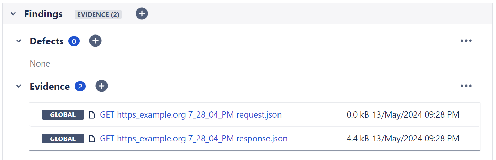

# Upload request data

The plugin is able to record web requests executed by [`cy.request`](https://docs.cypress.io/api/commands/request) which can then be added as execution evidence to the test execution issue during the results upload.



## Setup

To upload your web requests and responses to Xray, you need to allow the plugin to overwrite the existing `cy.request` command in your [support file](https://docs.cypress.io/guides/core-concepts/writing-and-organizing-tests#Support-file) and enable the upload in its configuration:

=== "commands.js"

    ```js
    import "cypress-xray-plugin/commands";
    ```

=== "cypress.config.js"

    For details see [`uploadRequests`](../configuration/xray.md#uploadrequests).

    ```js
    import { configureXrayPlugin } from "cypress-xray-plugin";

    async setupNodeEvents(on, config) {
        await configureXrayPlugin(on, config, {
            // ...
            xray: {
                uploadRequests: true
            }
        });
    }
    ```

By default, requests and responses are uploaded as JSON data with the following naming scheme:

| type     | scheme                                          |
| -------- | ----------------------------------------------- |
| request  | `#!js <method> <url> <timestamp> request.json`  |
| response | `#!js <method> <url> <timestamp> response.json` |

!!! note
    The plugin will only upload requests and responses as JSON evidence for tests [that are associated with existing test issues](./targetingExistingIssues.md).

!!! question "But I have already had to overwrite `cy.request` for other purposes?"
    The plugin also exports its task queue so that you can invoke it manually, rather than letting the single import override all existing `cy.request` behaviour.
    This also allows for customisation of evidence file names.

    === "commands.js"

        ```js
        import { enqueueTask, PluginTask } from "cypress-xray-plugin/commands/tasks";

        Cypress.Commands.overwrite("request", (originalFn, request) => {
            return enqueueTask(PluginTask.OUTGOING_REQUEST, "my-request.json", request)
                .then((request) => {
                    // Do something with the request...
                    console.log(request);
                    return request;
                })
                .then(originalFn)
                .then((response) => {
                    // Do something with the response...
                    console.log(response);
                    return enqueueTask(PluginTask.INCOMING_RESPONSE, "my-response.json", response);
                });
        });
        ```

        You can also choose to only upload responses if you wish:

        ```js
        import { enqueueTask, PluginTask } from "cypress-xray-plugin/commands/tasks";

        Cypress.Commands.overwrite("request", (originalFn, request) => {
            return originalFn(request)
                .then((response) => {
                    return enqueueTask(PluginTask.INCOMING_RESPONSE, "my-response.json", response);
                });
        });
        ```

    === "cypress.config.js"

        For details see [`uploadRequests`](../configuration/xray.md#uploadrequests).

        ```js
        import { configureXrayPlugin } from "cypress-xray-plugin";

        async setupNodeEvents(on, config) {
            await configureXrayPlugin(on, config, {
                // ...
                xray: {
                    uploadRequests: true
                }
            });
        }
        ```
