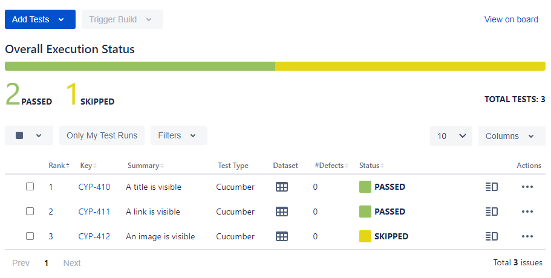

# Upload test results

<figure markdown>
  
  
  <figcaption>The plugin allows you to upload Cypress test results to Xray server or Xray cloud.</figcaption>
</figure>

<hr/>

## Setup

To upload your test results to Xray, make sure you have enabled the results upload in your configuration file:

```js
import { configureXrayPlugin } from "cypress-xray-plugin";

async setupNodeEvents(on, config) {
    await configureXrayPlugin(on, config, {
        xray: {
            uploadResults: true
        }
    });
}
```

Afterwards, simply run Cypress:

```sh
npx cypress run
```

!!! note
    Don't forget to provide your [authentication credentials](../configuration/authentication.md).

<hr/>

## How it works

The plugin will only upload results for tests you have linked to existing [test issues](targetingExistingIssues.md).

The plugin will also create a new test execution issue, unless you tell it to [reuse a specific test execution issue](../configuration/jira.md#testexecutionissuekey).

??? abstract "Xray Documentation"
    You can find more information on the mechanisms and constraints regarding imports of test execution results [here](https://docs.getxray.app/display/XRAY/Import+Execution+Results#ImportExecutionResults-XrayJSONformat) for Xray server and [here](https://docs.getxray.app/display/XRAYCLOUD/Using+Xray+JSON+format+to+import+execution+results#UsingXrayJSONformattoimportexecutionresults-XrayJSONformat) for Xray cloud.

## Uploading Cypress test results

The following example consists of three test cases for [https://example.org](https://example.org):

1. :white_check_mark: The first one tries to find an `#!html <h1>` element with text `Example Domain`.
2. :white_check_mark: The second one asserts that the page contains an `#!html <a>` element with a `href` attribute.
3. :x: The third one tries to find an `#!html ` element, which does not exist on the page.

When uploading the results, the plugin will create a test execution issue containing the three executed test issues.
Since Cypress automatically takes screenshots on failure, the execution will also contain the screenshot as evidence for the failed test case.

A corresponding video can be seen [here](../../index.md).

=== "demo.spec.cy.js"

    ```js
    describe("the upload demo", () => {

        beforeEach(() => {
            cy.visit("https://example.org");
        });

        it("CYP-410 Contains a title", () => {
            cy.get("h1").should("contain.text", "Example Domain");
        });

        it("CYP-411 Contains a link", () => {
            cy.get("a").should("have.attr", "href");
        });

        it("CYP-412 Fails a test", () => {
            cy.get("img").should("be.visible");
        });

    })
    ```

=== "cypress.config.js"

    ```js
    import { configureXrayPlugin } from "cypress-xray-plugin";

    async setupNodeEvents(on, config) {
        await configureXrayPlugin(on, config, {
            jira: {
                projectKey: "CYP",
                url: "https://atlassian.com"
            },
            xray: {
                uploadResults: true
            }
        });
    }
    ```

## Uploading Cucumber test results

The following example consists of three scenarios for [https://example.org](https://example.org), wrapping the tests described [above](#uploading-cypress-test-results).
Since we know that the image test will always fail, we'll [mark it as _skipped_](https://github.com/badeball/cypress-cucumber-preprocessor/blob/master/docs/tags.md) to make use of custom Xray statuses (see [here](../configuration/xray.md#status) for more information).

!!! note
    The Cucumber preprocessor plugin reports skipped scenarios by marking all the _steps_ they contain as skipped.
    To mark a Cucumber _test_ as skipped in Xray, you need to specify the respective _step_ status.
    Xray will then combine the steps' statuses according to your status settings into an overall test status (e.g. if at least one step was skipped, the entire test will be considered skipped).

When uploading the results, the plugin will create a test execution issue containing the three executed scenarios.
As the third scenario has been marked as skipped and a custom status has been provided for skipped steps, the entire test for the image verification will also be marked as skipped.



!!! note
    Please read the [Cucumber setup guide](../setup/installation.md#cucumber-tests) if you're confused about what's going on below.

=== "scenarios.feature"

    ```gherkin
    Feature: Example page UI tests

        # Each scenario must be tagged with its corresponding
        # Jira test issue key and global Xray tag prefix.
        @TestName:CYP-410
        Scenario: A title is visible
            Given the example page
            Then the title is visible

        @TestName:CYP-411
        Scenario: A link is visible
            Given the example page
            Then the link is visible

        @skip
        @TestName:CYP-412
        Scenario: An image is visible
            Given the example page
            Then an image is visible
    ```

=== "cypress.config.js"

    ```js
    import { addCucumberPreprocessorPlugin } from "@badeball/cypress-cucumber-preprocessor";
    import createEsbuildPlugin from "@badeball/cypress-cucumber-preprocessor/esbuild";
    import createBundler from "@bahmutov/cypress-esbuild-preprocessor";
    import { defineConfig } from "cypress";
    import fix from "cypress-on-fix";
    import { configureXrayPlugin, syncFeatureFile } from "cypress-xray-plugin";

    async setupNodeEvents(on, config) {
        const fixedOn = fix(on);
        await addCucumberPreprocessorPlugin(fixedOn, config);
        await configureXrayPlugin(fixedOn, config, {
            jira: {
                projectKey: "CYP",
            },
            xray: {
                status: {
                    step: {
                        skipped: "SKIPPED"
                    }
                },
                uploadResults: true
            },
            cucumber: {
                featureFileExtension: ".feature",
                prefixes: {
                    test: "TestName:"
                }
            }
        });
        fixedOn("file:preprocessor", async (file) => {
            await syncFeatureFile(file);
            const cucumberPlugin = createBundler({
                plugins: [createEsbuildPlugin(config)],
            });
            return cucumberPlugin(file);
        });
        return config;
    }
    ```

=== "steps.js"

    ```js
    import { Given, Then } from "@badeball/cypress-cucumber-preprocessor";

    Given("the example page", () => {
        cy.visit("https://example.org");
    });

    Then("the title is visible", () => {
        cy.get("h1").should("contain.text", "Example Domain");
    });

    Then("the link is visible", () => {
        cy.get("a").should("have.attr", "href");
    });

    Then("an image is visible", () => {
        cy.get("img").should("be.visible");
    });
    ```