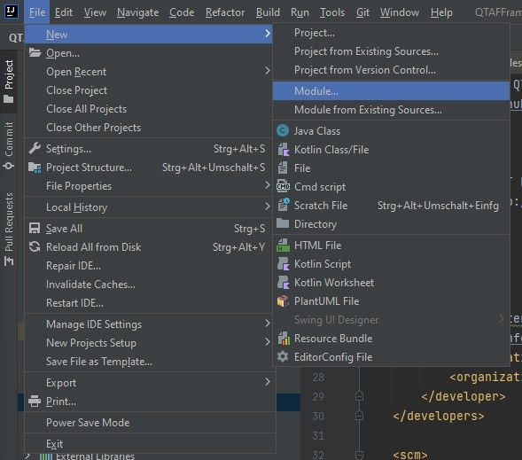
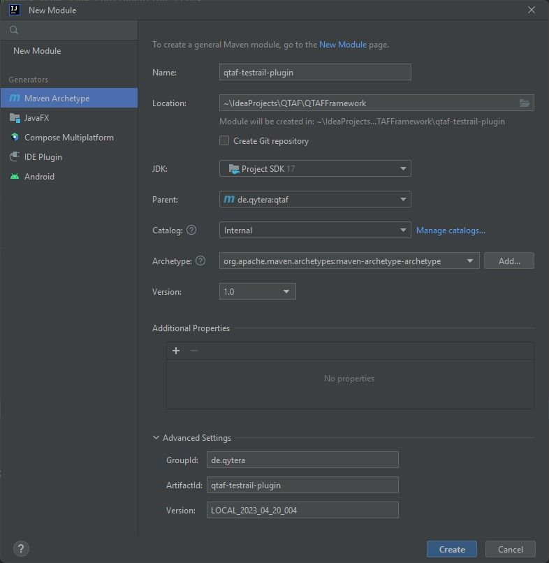
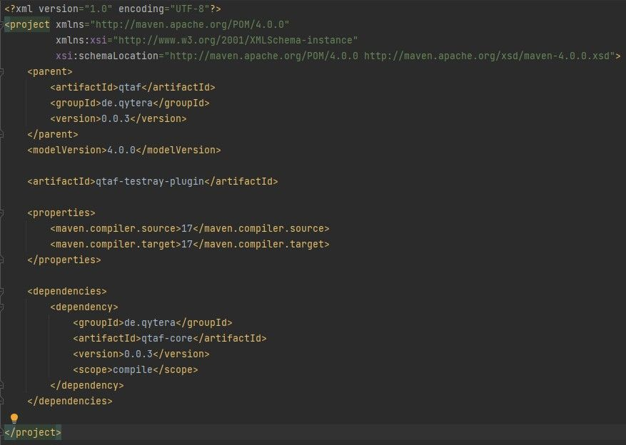
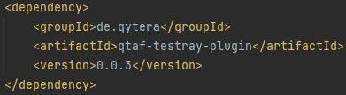
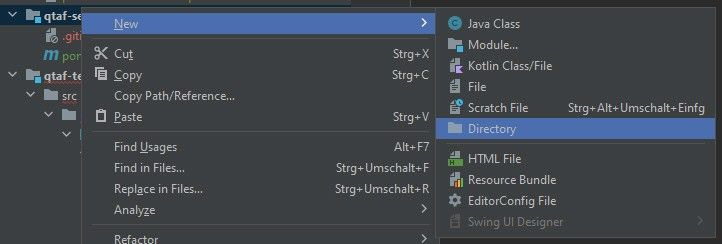
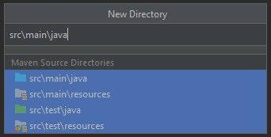
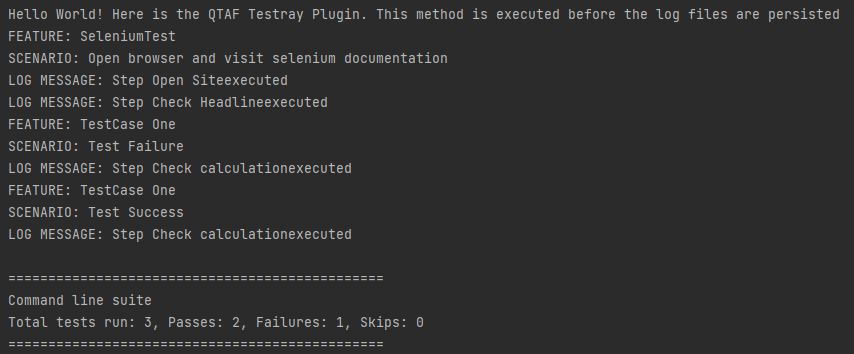

# Creating a new module / plugin

This article describes how to create a new QTAF module. Module bündeln den Code von Plugins oder Bibliotheken. Beispiele für existierende QTAF-Module sind `qtaf-allure-plugin`, `qtaf-xray-plugin`, `qtaf-io`, `qtaf-http`.

## Prerequisites

- Clone the QTAF repository to your PC.
- Make sure that GPG is installed on your PC. Prüfen Sie dies mit dem Befehl `gpg --version`. Wenn GPG nicht installiert ist befolgen Sie diese Anleitung, um GPG zu installieren
- First install QTAF locally. You can find the corresponding instructions <a href="https://qytera-gmbh.github.io/projects/qtaf/sections/dive/Setup_QTAF_Locally/" target="_blank">here</a>

## Create a new module

1. open the QTAF project in IntelliJ
2. click on `File > New > Module` in the menu

3. then select `Maven Archetype` in the left side menu. You will then be asked for the name, the GroupId, the ArtifactId and the version number of the new module. For GroupId select `en.qytera`, the ArtifactId can be freely selected. The name of the module should be identical to the ArtifactId and the version number identical to the version number of the parent module `qtaf`. Then click on the "Finish" button. A new folder should then have been created in the project with the name of the new module. In this folder you will find the POM file of the new module. 4.

4. add the `qtaf-core` dependency to the POM file of the new module

5 After the local installation, you can integrate the new module as a dependency in a local project.

6. create the packages `en.qytera.qtaf.<modulename>` in the `src/main/java` folder of your new module, whereby `<modulename>` can be freely selected by you. However, the package `<modulename>` must be in the package `en.qytera.qtaf`. Otherwise, dependency injections of the QTAF framework will not work, as certain classes such as EventSubscriber are always searched for in packages that are in the namespace `en.qytera.qtaf`.

You can create the new directories by right-clicking on your module folder in the QTAF project. After right-clicking, navigate to New > Directory.
Then select the four standard directories and click Enter.

7. create another package called event_subscriber in the `<modulename>` package
8. create a class in the package `event_subscriber` that implements the interface `IEventSubscriber` of the QTAF framework. Using the event subscriber, plug-ins can react to events generated by the QTAF framework. For example, you can subscribe to the `beforeLogsPersisted` event to process the data of the current test run. You can use the following sample code to display a message on the console as soon as the data is available:

```java
package de.qytera.qtaf.testray.event_subscriber;

import de.qytera.qtaf.core.events.QtafEvents;
import de.qytera.qtaf.core.events.interfaces.IEventSubscriber;
import de.qytera.qtaf.core.log.model.collection.TestSuiteLogCollection;
import rx.Subscription;

public class UploadResultsSubscriber implements IEventSubscriber {

    /**
     * Subscription reference
     */
    Subscription onBeforeLogsPersistedSub;

    @Override
    public void initialize() {
        this.onBeforeLogsPersistedSub = QtafEvents.beforeLogsPersisted.subscribe(
                this::onBeforeLogsPersisted
        );
    }

    /**
     * Event handler @param logCollection Log collection
     */
    private void onBeforeLogsPersisted(TestSuiteLogCollection logCollection) {
        System.out.println("Hello World! Here is the QTAF Testray Plugin. " +
                "This method is executed before the log files are persisted");
    }
}
```
Further information about the QTAF event system can be found in <a href="https://qytera-gmbh.github.io/projects/qtaf/sections/dive/QTAF_Event_System/" target="_blank">this</a> article. You can now implement your own logic for processing the test data within the `onBeforeLogsPersisted` method. An exemplary (albeit not very useful) method would be to output all names of test features and test scenarios as well as all associated log messages to the console. This would look like this:

```java
    /**
     * Event handler @param logCollection Log collection
     */
    private void onBeforeLogsPersisted(TestSuiteLogCollection logCollection) {
        System.out.println("Hello World! Here is the QTAF Testray Plugin. " +
                "This method is executed before the log files are persisted");

        for (TestFeatureLogCollection featureLogCollection : logCollection.getTestFeatureLogCollections()) {
            System.out.println("FEATURE: " + featureLogCollection.getFeatureName());

            for (TestScenarioLogCollection scenarioLogCollection : featureLogCollection.getScenarioLogCollection()) {
                System.out.println("SCENARIO: " + scenarioLogCollection.getScenarioName());

                for (LogMessage logMessage : scenarioLogCollection.getLogMessages()) {
                    System.out.println("LOG MESSAGE: " + logMessage.getMessage());
                }
            }
        }
    }
```
9. now you can install the new module locally with the command `mvn clean install`. You can use a temporary version number such as `LOCAL_2023_01_01-001` for the local version. You can find more information on this in <a href="https://qytera-gmbh.github.io/projects/qtaf/sections/dive/Setup_QTAF_Locally/" target="_blank">this</a> article.
10. now integrate the new module into a test project via the POM file. The dependency for our example module would look like this:

```xml
<dependency>
    <groupId>de.qytera</groupId>
    <artifactId>qtaf-testray-plugin</artifactId>
    <version>0.0.3</version>
</dependency>
```
11. then execute the `TestRunner` class in your test project. You will see that our new module now generates an output on the console.

