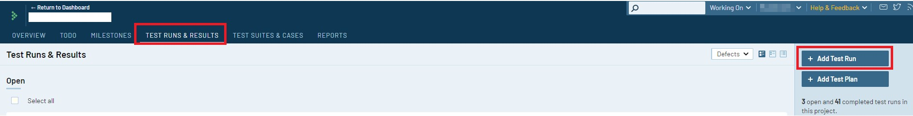

# Configuration

TestRail's API is employed to integrate automated tests and submit the results of the implemented test cases. This API operates on an HTTP basis and can be leveraged using any framework or programming language. The TestRail Qtaf Plugin is implemented in Java.

In this article, we'll guide you on creating test runs in TestRail, linking your test runs to the test cases specified in TestRail, and how QTAf can automatically record the test results of your runs in TestRail.

## Creating Test Runs in TestRail

Assuming you've already outlined some test cases in TestRail (note: creating a test case in TestRail isn't covered in this tutorial. For instructions on that, refer to the following video: [TestRail's Test Cases](https://www.youtube.com/watch?v=j6_-b1n6BXU&ab_channel=TestRail)), 
to craft a test run, navigate to the "TEST RUNS & RESULTS" tab, select "Add Test Run", and pick the corresponding test suite.



After creating the test run, you should append the test cases to it. There are three methods to achieve this:


## QTAF and TestRail Integration

This section shows how the results, attachements and report could be sent to TestRail.

This segment illustrates how to transmit results, attachments, and reports to TestRail.

Firstly, besides `qtaf-core`, you need to integrate the `qtaf-testrail-plugin` dependency into your project. Ensure you have the most recent version numbers of these modules, which can be verified at the <a href="https://mvnrepository.com/artifact/de.qytera" target="_blank">Maven Repository</a>

```xml
<dependencies>
    <dependency>
        <groupId>de.qytera</groupId>
        <artifactId>qtaf-core</artifactId>
        <version>${qtafVersion}</version>
        <scope>compile</scope>
    </dependency>
    <dependency>
        <groupId>de.qytera</groupId>
        <artifactId>qtaf-testrail-plugin</artifactId>
        <version>${qtafVersion}</version>
        <scope>compile</scope>
    </dependency>
</dependencies>
```

Next, you need to store TestRail credentials within the `qtaf.json` file. Insert the following section into the file:

```json
{
  ...
  "testrail": {
    "enabled": true,
    "url": "xxxxxxxx",
    "runId": "xxxxx",
    "authentication": {
      "clientId": "xxx@xxx.xxx",
      "clientSecret": "xxxxxxxxxx"
    }
  }
  ...
}
```

Remember to activate the TestRail Plugin by toggling the `enabled` flag.

After setting up TestRail and saving the credentials, utilize the TestRail Annotation to mark the test case. Below is an illustrative example:

```java
import de.qytera.qtaf.testrail.annotations.TestRail;

@TestFeature(
        name = "DoGoogleSearch",
        description = "Perform a search for text 'Hello World'"
)
public class DoGoogleSearch extends TestContext {
    @Test(
            testName = "TestGoogleSearch",
            description = "Type 'Hello World' and click search button",
            groups = {"Group 1", "Group 2"}
    )
    @TestRail(caseId = {"11111"}, runId = "1111")
    public void TestCaseGoogleSearch()
    {
        // test logic here
    }
}
```


To map a test class to a test in TestRail, apply the `@TestRail` annotation to the appropriate Java method. The `caseId` and `runId` attributes of the annotation should match the test case ID and test run ID in TestRail.

Images are provided to guide you in locating the test case ID and test run ID.

- To get the test run id, click on "TEST RUNS & RESULTS" tab, choose your test run, top in the left corner you can find the id, it is framed with black in the following image:


- To get the test case id, click on "TEST SUITES & CASES" tab, choose your test suite, then you test case, top in the left corner you can find the id, it is framed with black in the following image:


In order to also document the test steps, methods must be called in the test that are provided with the annotation `@Step` of the Qtaf framework. In this example, we assume that there are two methods that are defined in a separate class called `GoogleFunctionsPage`.

```java
public class GoogleFunctions extends TestContext
{
    @Step(
            name = "Search value",
            description = "Search for a value"
    )
    public void doSearch(String searchValue) {
        driver.findElement(By.xpath(UsedObject.SearchInputXPath())).sendKeys(searchValue);
        driver.findElement(By.name(UsedObject.GoogleSearchButtonName())).click();
    }

    @Step(
            name = "Go to Google home page",
            description = "Navigate to the Google home page"
    )
    public void goToGoogleHome() {
        driver.get(UsedObject.GoogleHome());
    }
}
```

We then call these methods in the test case.

```java
@TestFeature(
        name = "DoGoogleSearch",
        description = "Perform a search for text 'Hello World'"
)
public class DoGoogleSearch extends TestContext
{
    @Test(
            testName = "TestGoogleSearch",
            description = "Type 'Hello World' and click search button",
            groups = {"Group 1", "Group 2"}
    )
    @TestRail(caseId = {"11111"}, runId = "1111")
    public void TestCaseGoogleSearch()
    {
         // 1. Open Google
        googleFunctionPage.goToGoogleHome();

        // 2. Execute Search
        googleFunctionPage.doSearch("Hello World");
    }
}
```

Qtaf registers the call of these methods and logs the call in the background. Here, no IDs need to be defined for the test steps. Qtaf assigns the called methods in the order of the steps defined in TestRail.

Now execute your test cases as usual. After the execution of your test cases is finished, QTAF will show you the following statement in the console:

```
INFO  de.qytera.qtaf.core - Results are uploaded to testRail
```

This means that the upload to TestRail was successful.

<hr>
<div style="display: flex; flex-direction: row; justify-content: space-between">
  <a href="https://www.qytera.de" target="_blank">Developed with love by Qytera, Germany</a>
  <span>|</span>
  <a href="https://www.qytera.de/testautomatisierung-workshop" target="_blank">Support & Service</a>
  <span>|</span>
  <a href="https://github.com/Qytera-Gmbh/QTAF" target="_blank">QTAF Repository</a>
  <span>|</span>
  <a href="https://www.qytera.de/kontakt" target="_blank">Contact</a><br>
</div>

