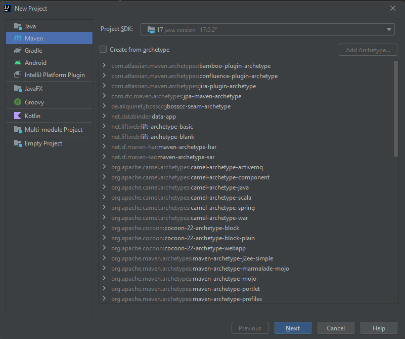
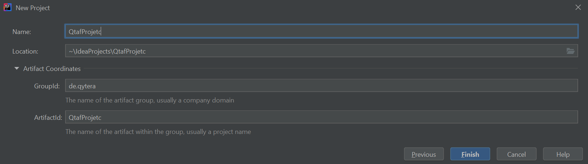

# Setup new QTAF Project with IntelliJ and Maven

Before you read this article you should be familiar with the QTAF framework. You can read [this article](../steps/New_QTAF_Project.md) if you want to understand the Java code which is shown here.

To create a new project, we use the IntelliJ IDE from Jetbrains. Here we navigate in the menu to `File > New > Project` and then select `Maven` in the left selection menu and click on Next.



We are then asked for a name for the project. This can be chosen freely, but in this example we use the name "QtafProject". It is recommended to also specify the GroupId of the project. This is an identifier for the creator of the project. It is common to choose the company's domain for this, but starting with the country- or organisation-specific ending of the domain. For a company domain "acme.org", one would choose the GroupId "org.acme" according to this standard. The GroupId can be found in the sub-item `Artifact Coordinates`. Then we click on `Finish`. The new project should now have been created in the folder `~\IdeaProjects\QtafProject`, where `~` is a placeholder for the root directory of the currently logged in user.



In the root directory of the project we see the file pom.xml. This file is used to configure Maven projects, i.e. to load external libraries, to control the build process, etc.

The following additions should be entered in the file:

```xml
<project>
    <!-- ... -->

    <!-- Here we define the Java version of the project -->
    <properties>
        <maven.compiler.source>17</maven.compiler.source>
        <maven.compiler.target>17</maven.compiler.target>
    </properties>

    <!-- Here you can add external Java libraries to your project -->
    <dependencies>

    </dependencies>

    <!-- Everything is configured here for the build process -->
    <build>
        <!-- Path under which Java should search for files (resources) -->
        <resources>
            <resource>
                <directory>src/main/resources</directory>
                <filtering>true</filtering>
            </resource>
        </resources>
    </build>

</project>
```

<hr>
<div style="display: flex; flex-direction: row; justify-content: space-between">
  <a href="https://www.qytera.de" target="_blank">Developed with love by Qytera, Germany</a>
  <span>|</span>
  <a href="https://www.qytera.de/testautomatisierung-workshop" target="_blank">Support & Service</a>
  <span>|</span>
  <a href="https://github.com/Qytera-Gmbh/QTAF" target="_blank">QTAF Repository</a>
  <span>|</span>
  <a href="https://www.qytera.de/kontakt" target="_blank">Contact</a><br>
</div>
